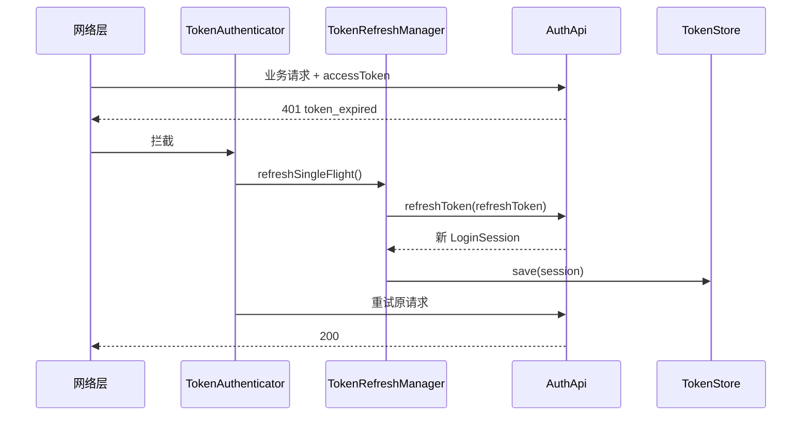
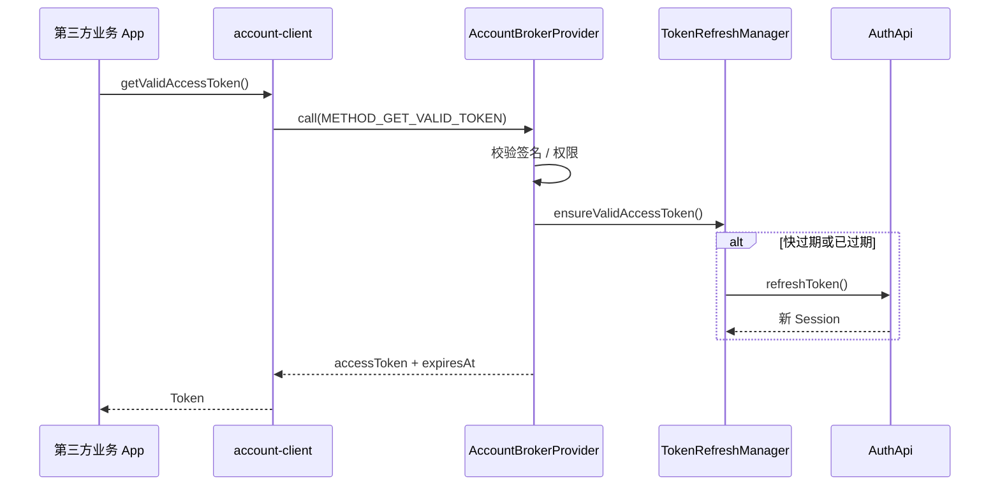

# 账号中转站（Account Broker）与 Token 自动刷新

> **文档类型**：技术方案 · 账号中台  
> **版本**：1.0  
> **关联**：[MULTI_APP_ARCHITECTURE.md](./MULTI_APP_ARCHITECTURE.md) · [DEVELOPMENT.md](./DEVELOPMENT.md) · [INTEGRATION.md](./INTEGRATION.md)

---

## 1. 需求概述

| 需求 | 说明 |
|------|------|
| **401 自动刷新** | 业务 API 返回 401（token 过期）时，自动调用 refresh 接口并重试 |
| **账号中转站** | 个人中心 App 作为账号宿主，通过 **ContentProvider** 向其他 App 分发 Token |
| **主动刷新** | 第三方 App 调用 Provider 时，Broker **先 ensureValid + refresh**，再返回最新 accessToken |

**原则：`login-sdk` 与 `account-broker` 分模块；刷新逻辑在 core 只写一份。**

---

## 2. 模块划分

```text
login-sdk-core (KMP)
├── TokenRefreshManager      ← 401 刷新、过期检查、单飞锁
├── AuthApi.refreshToken()
└── TokenStore

account-broker-android (仅个人中心 App)
├── AccountBrokerProvider    ← ContentProvider
├── AccountBrokerStore       ← 加密 Session 存储
└── CallerVerifier           ← 签名校验 / 权限

account-client-android (业务 App)
├── AccountClient.getValidAccessToken()
└── TokenAuthenticator       ← 401 拦截辅助（可选）

common-network (可选)
└── OkHttp/Ktor 401 拦截 → TokenRefreshManager
```

| 模块 | 谁依赖 | 能否单独卖 |
|------|--------|------------|
| login-sdk-core | 所有 App | ✅ |
| account-broker-android | **仅个人中心 App** | ✅ |
| account-client-android | 只要 Token 的业务 App | ✅ |

---

## 3. 401 自动刷新（login-sdk-core）

### 3.1 流程



### 3.2 核心 API（规划）

```kotlin
object TokenRefreshManager {
    /** 单飞刷新：并发 401 只刷一次 */
    suspend fun refreshSingleFlight(): AuthResult

    /** 请求前：快过期则先刷 */
    suspend fun ensureValidAccessToken(): String

    /** 刷新不可恢复 → 清 Session，通知重新登录 */
    fun onRefreshFailed(result: AuthResult)
}
```

### 3.3 实现要点

| 点 | 说明 |
|----|------|
| **单飞锁** | Mutex；多请求同时 401 只一次 refresh，其余 await 结果 |
| **401 分类** | 仅 `token_expired` / `invalid_token` 才 refresh |
| **失败降级** | refresh 失败 → logout → 回调宿主 `launchLogin()` |
| **与 WorkManager 关系** | 401 刷新 **不依赖** WorkManager；后台静默刷为可选（platform-android） |

### 3.4 当前 Demo 状态

| 能力 | 状态 |
|------|------|
| `LoginSDK.refreshToken()` 手动调用 | ✅ |
| 401 拦截 + 自动重试 | ❌ 待 Phase 1 |
| `TokenRefreshManager` 单飞 | ❌ 待 Phase 1 |

---

## 4. ContentProvider 账号中转站（Android）

### 4.1 角色

| App | 角色 | 模块 |
|-----|------|------|
| **个人中心 App** | 账号宿主，登录后发布 Session | login-sdk + account-broker |
| **业务 App** | 消费 Token，可不展示登录 UI | account-client |

### 4.2 调用流程（主动刷新）



### 4.3 Provider 方法约定

| method | 说明 | 调用方 |
|--------|------|--------|
| `getValidToken` | 返回有效 accessToken（内部可 refresh） | 业务 App |
| `getSession` | 返回受控 Session 字段 | 授权 App |
| `ensureLogin` | 无 Session 时返回需登录码 | 业务 App |
| `publishSession` | 登录成功后写入 Broker | **仅宿主 App** |
| `invalidate` | 登出 / 作废 Token | 宿主或授权 App |

```kotlin
// 业务 App 示例
val result = contentResolver.call(
    Uri.parse("content://com.yourcompany.account.broker"),
    "getValidToken",
    null,
    null,
)
val token = result?.getString("access_token")
```

### 4.4 登录成功后发布 Session

```kotlin
LoginSDK.launchLogin(object : LoginCallback {
    override fun onSuccess(session: LoginSession) {
        AccountBroker.publish(session)  // account-broker API
    }
    override fun onError(error: LoginError) { }
    override fun onCancel() { }
})
```

---

## 5. 401 与 Broker 如何配合

| 场景 | 路径 |
|------|------|
| 业务 App **先取 Token 再请求** | `account-client.getValidAccessToken()` → Provider 内 refresh → 带新 Token 请求 |
| 业务 App **请求遇 401** | `TokenAuthenticator` → `refreshSingleFlight()` 或再调 Provider `getValidToken` → 重试 |
| **个人中心 App** 自己请求 401 | 直接 `TokenRefreshManager`（不经 Provider） |

**刷新实现只有一份：`TokenRefreshManager`（core）。Broker 与 401 拦截都调用它。**

---

## 6. 安全要求

| 项 | 说明 |
|----|------|
| 自定义 `signature` 权限 | Provider `android:permission`，仅自家签名 App |
| 调用方包名 + 签名校验 | `PackageManager` 校验 |
| Token 存储 | EncryptedSharedPreferences / Keystore |
| 返回字段最小化 | 业务 App 仅拿 accessToken / expiresAt |
| 审计日志 | 记录 caller packageName（不 log Token 明文） |

---

## 7. 与其他平台

| 平台 | 中转机制 |
|------|----------|
| **Android** | ContentProvider（本文） |
| **iOS** | App Groups + Keychain，或 URL Scheme / XPC（`account-broker-ios` 规划） |
| **Flutter 业务 App** | Android：`account-client` Plugin；iOS：对应 Broker Client |

ContentProvider **无 iOS 等价物**，需单独模块。

---

## 8. 与 login-sdk 的边界

| | login-sdk | account-broker |
|--|-----------|----------------|
| 登录 UI | ✅ | ❌ |
| 登录 / 登出业务 | ✅ | ❌ |
| 本 App Session | ✅ | ❌ |
| 跨 App 分发 Token | ❌ | ✅ |
| ContentProvider | ❌ | ✅ |
| 401 refresh 逻辑 | ✅（core） | 调用 core |

**业务 App 不应被迫依赖 ContentProvider** —— 仅需 Token 时依赖 `account-client`，不依赖 `login-sdk-ui`。

---

## 9. 实施路线

| 阶段 | 内容 |
|------|------|
| **P1** | core：`TokenRefreshManager` + `ensureValidAccessToken()` + 单飞锁 |
| **P2** | OkHttp/Ktor `TokenAuthenticator`（401 → refresh → retry） |
| **P3** | `account-broker-android`：Provider + 加密存储 + 签名校验 |
| **P4** | `account-client-android`：`getValidAccessToken()` |
| **P5** | iOS `account-broker-ios`（App Groups） |

---

## 10. 相关文档

- [MULTI_APP_ARCHITECTURE.md](./MULTI_APP_ARCHITECTURE.md) — 多 App 双 SDK 方案
- [DEVELOPMENT.md](./DEVELOPMENT.md) §7 — 与账号中台关系
- [DISTRIBUTION.md](./DISTRIBUTION.md) — broker 与 login-sdk 分开发布

---

## 修订记录

| 版本 | 日期 | 说明 |
|------|------|------|
| 1.0 | 2026-06 | 401 刷新 + ContentProvider 账号中转站方案 |
