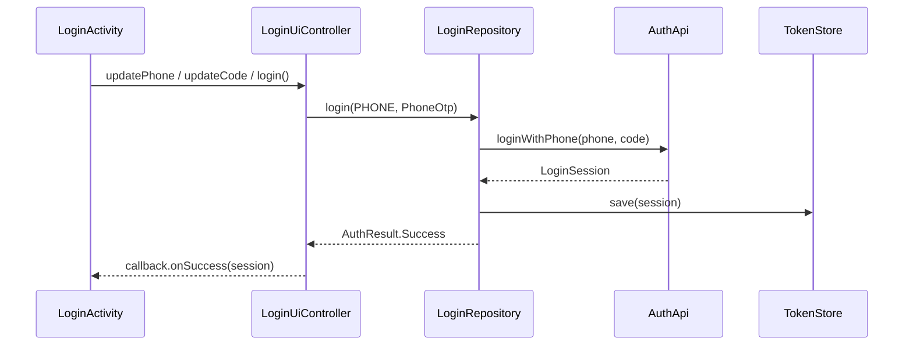
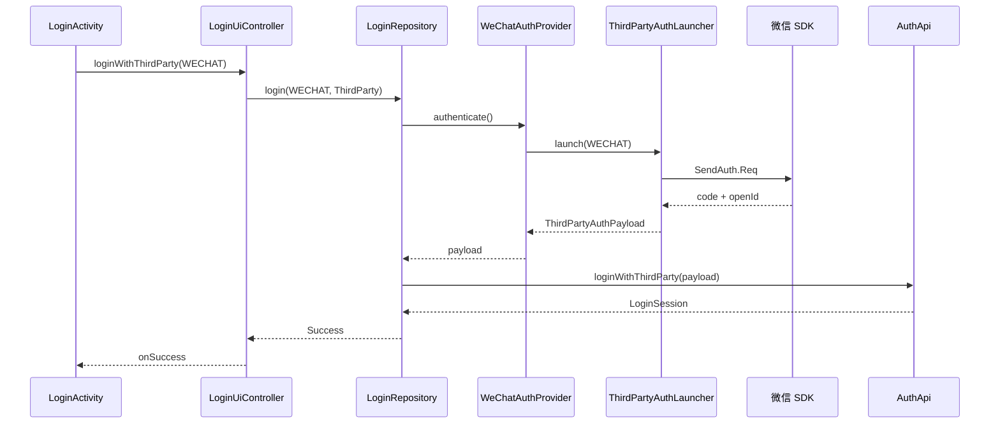

# 架构设计详解

## 1. 核心设计模式

### 1.1 Facade 模式 — `LoginSDK`

对外暴露唯一入口，隐藏 `Repository`、`Registry`、`Provider` 等内部细节。宿主 App 只 import `com.example.login.sdk.api.*`。

### 1.2 Strategy 模式 — `AuthProvider`

每种登录方式是一个独立策略：

```
AuthProvider (interface)
├── PhoneAuthProvider      # commonMain
├── EmailAuthProvider      # commonMain
├── WeChatAuthProvider     # androidMain / iosMain
├── AppleAuthProvider      # androidMain / iosMain
└── GoogleAuthProvider     # androidMain / iosMain
```

新增登录方式 = 新增 Provider 实现 + 注册，符合开闭原则。

### 1.3 依赖倒置 — `AuthApi` / `TokenStore` / `ThirdPartyAuthLauncher`

| 接口 | 默认实现 | 生产替换 |
|------|----------|----------|
| `AuthApi` | `MockAuthApi` | Ktor / Retrofit Client |
| `TokenStore` | `InMemoryTokenStore` | EncryptedSharedPreferences / Keychain |
| `ThirdPartyAuthLauncher` | `DemoThirdPartyAuthLauncher` | 宿主 Activity 注入 |

SDK 核心依赖抽象，不依赖具体平台 SDK。

### 1.4 MVVM 变体 — `LoginUiContract`

```
View (Activity / Kuikly Page)
    ↕ state: StateFlow<LoginUiState>
    ↕ events: login() / sendCode() / ...
LoginUiController
    ↕
LoginRepository
```

View 层不包含业务逻辑，只负责渲染和用户事件转发。

---

## 2. 登录流程时序

### 2.1 手机号登录



### 2.2 微信登录



---

## 3. 模块边界

### 3.1 login-sdk 对外可见包

```
com.example.login.sdk.api          # 公开 API（Facade、Config、Callback）
com.example.login.sdk.auth         # 公开模型（AuthMethod、LoginSession 等）
com.example.login.sdk.ui           # 公开 UI 契约（LoginUiContract、LoginUiState）
com.example.login.sdk.provider     # 公开通用 Provider
com.example.login.sdk.provider.android  # Android Provider 工厂
com.example.login.sdk.provider.ios      # iOS Provider 工厂
```

### 3.2 内部包（不对外暴露）

```
com.example.login.sdk.internal     # Repository、Registry 实现、Mock
```

正式发布 AAR 时通过 ProGuard / API Dump 隐藏 internal 包。

---

## 4. 与 Kuikly 的集成点

| 集成点 | 预演实现 | Kuikly 正式实现 |
|--------|----------|----------------|
| 登录 UI | `commonMain/LoginScreen`（Compose Multiplatform，Android/iOS 共用） | 可选迁移 Kuikly `@Page` |
| 拉起登录 | `LoginSDK.launchLogin()` | **保持不变** |
| UI 状态 | `StateFlow` + collect | Kuikly 响应式 `observable` |
| 页面路由 | Intent 跳转 | `RouterModule` / `@Page` KSP 路由 |
| 平台能力 | `ThirdPartyAuthLauncher` | Kuikly `Module` 机制 |
| 容器 | Activity | `KuiklyRenderActivity` / `KuiklyBaseView` |

**关键原则：迁移 UI 时，`LoginUiContract` 和 `LoginSDK` API 保持不变。**

---

## 5. 数据模型

```kotlin
LoginSession
├── userId: String
├── accessToken: String
├── refreshToken: String?
├── expiresAtEpochMs: Long?
├── loginMethod: AuthMethod
└── profile: UserProfile?
    ├── nickname
    ├── avatarUrl
    ├── email
    └── phone

ThirdPartyAuthPayload（Provider → AuthApi）
├── method: AuthMethod
├── authorizationCode    # 微信
├── idToken              # Apple / Google
├── accessToken          # Google
├── openId               # 微信
├── email
└── displayName
```

---

## 6. 错误处理

```kotlin
sealed class LoginError {
    ProviderNotAvailable   // 平台不支持 / 未安装微信
    InvalidCredentials     // 验证码/密码错误
    Network                // 网络/后端错误
    ThirdParty             // 第三方 SDK 错误
    Unknown
}
```

Repository 层捕获异常并映射为 `AuthResult.Failure(code, message)`，Controller 层再映射为 `LoginError` 回调给宿主。

---

## 7. 测试策略

| 层级 | 测试方式 |
|------|----------|
| Repository | 单元测试 + Mock AuthApi / Provider |
| Provider | 单元测试（common）+ Instrumented（第三方 SDK） |
| UI Controller | 单元测试 state 变化 |
| 集成 | android-host Demo 手动 / Espresso |

运行单元测试：

```bash
./gradlew :login-sdk:cleanAllTests :login-sdk:allTests
```

---

## 8. 性能与选型

本预演工程定位为**可嵌入的登录 SDK**，性能对比重点不是整 App 渲染帧率，而是 SDK 体积、冷启动、交互响应与第三方授权链路。

与 Flutter Module、H5 WebView SDK 的完整对比见 **[PERFORMANCE.md](./PERFORMANCE.md)**。

**架构层结论：**

- Kuikly/KMP 走原生渲染，无 Flutter Engine、无 WebView JS 桥，登录页冷启动与内存最接近原生
- 第三方登录（微信 / Apple / Google）三方案均跳转原生 SDK，差异主要在回调可靠性（H5 最弱）
- 正式立项后建议补 B1~B5 Benchmark（见 PERFORMANCE.md §7）
