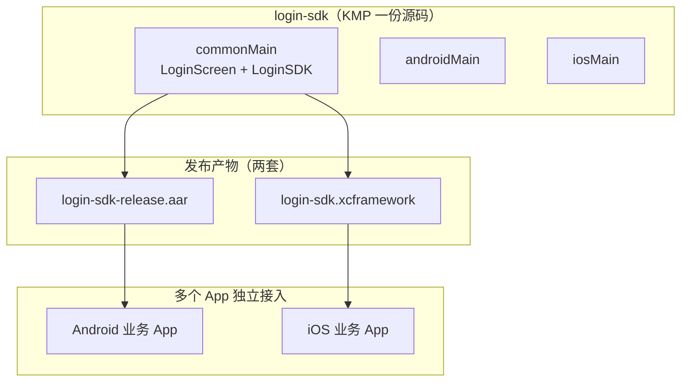

# Login SDK 分发与多端依赖 — 技术预研

> 版本：0.2.0-preview  
> 适用：个人中心、业务 App A/B/C 等多端复用 `login-sdk`  
> 关联：[接入文档](./INTEGRATION.md) · [开发文档](./DEVELOPMENT.md)

---

## 1. 核心结论（预研结论）

| 问题 | 结论 |
|------|------|
| 能否用一个 Git 地址 / 一行依赖搞定 Android + iOS？ | **不能**。Gradle 与 Xcode/CocoaPods 生态不同，不存在 `implementation("https://github.com/...")` 这种双端通用写法。 |
| KMP 解决了什么？ | **源码写一份**（`commonMain`）、**API 统一**（`LoginSDK`）、**登录 UI 一致**（`LoginScreen.kt`）。 |
| KMP 没解决什么？ | **发布物仍是两套**：Android → `.aar` / Maven 坐标；iOS → `.xcframework` / CocoaPods / SPM。 |
| 最简单的方式？ | **开发期**：源码 `project(":login-sdk")`；**正式给多 App**：同版本 **AAR + XCFramework**，推荐 **Git Tag + CI 一次打出双产物**。 |
| Windows 能否完成全部？ | **Android 可**（编 AAR、跑 Demo）；**iOS 产物与模拟器验证需 Mac**。 |



---

## 2. 按阶段选型（推荐）

| 阶段 | 场景 | 推荐方式 | 复杂度 |
|------|------|----------|--------|
| **P0 预研 / 联调** | 本仓库 Demo、`android-host` | `implementation(project(":login-sdk"))` | ⭐ 最低 |
| **P1 多仓库开发** | 个人中心、业务 App 分仓 | **Git Submodule** + `project(":login-sdk")` | ⭐⭐ |
| **P2 内部分发** | 给兄弟团队试用 | 本地 **AAR** + **XCFramework** 拷贝 | ⭐⭐ |
| **P3 正式生产** | 多 App 长期维护 | **Git Tag** → CI 发布 **Maven + CocoaPods**（同版本号） | ⭐⭐⭐ 一次配置长期省事 |
| **P4 仅 Android 快速试** | 暂不做 iOS | GitHub + **JitPack** `com.github.xxx:login-sdk:tag` | ⭐⭐（iOS 不适用） |

**本预研工程建议路径：**

```
当前（P0）→ Submodule（P1）→ Tag + CI 双产物（P3）
```

---

## 3. 方式一：源码依赖（开发期最简单）

### 3.1 单仓库多模块（当前 Demo）

```kotlin
// settings.gradle.kts
include(":login-sdk")
include(":android-host")

// android-host/build.gradle.kts
dependencies {
    implementation(project(":login-sdk"))
}
```

- ✅ 不打包、不改版本即可联调  
- ✅ Android / iOS 共用同一 `login-sdk` 模块  
- ❌ 不适合 SDK 与业务 App **完全独立分仓**且不想拷贝源码的场景  

### 3.2 Git Submodule（多仓库推荐）

在各业务 App 仓库：

```bash
git submodule add https://github.com/your-org/login-sdk.git libs/login-sdk
git submodule update --init --recursive
```

```kotlin
// settings.gradle.kts
include(":login-sdk")
project(":login-sdk").projectDir = file("libs/login-sdk")

// app/build.gradle.kts
dependencies {
    implementation(project(":login-sdk"))
}
```

| 优点 | 注意 |
|------|------|
| 依赖 Git 仓库，无需 Maven | 各 App 要 **锁定 submodule commit** 或跟随 Tag |
| Android / iOS 同一份源码 | 更新 SDK：`git submodule update --remote` 后回归测试 |
| 与 KMP 结构天然契合 | iOS 仍需 Mac 编译该模块 |

---

## 4. 方式二：构建产物依赖（正式推荐给多 App）

### 4.1 构建命令

```bash
# Android（Windows / Mac 均可）
./gradlew :login-sdk:assembleRelease
# → login-sdk/build/outputs/aar/login-sdk-release.aar

# iOS（仅 Mac）
./gradlew :login-sdk:assembleLoginSdkReleaseXCFramework
# → login-sdk/build/XCFrameworks/release/login-sdk.xcframework
```

> 注：XCFramework 聚合任务需在 `login-sdk/build.gradle.kts` 中配置 `XCFramework` 任务（正式立项时补齐）；预研阶段可先使用各架构 `linkReleaseFrameworkIos*` 产物。

### 4.2 Android 宿主依赖 AAR

**本地 AAR：**

```kotlin
dependencies {
    implementation(files("libs/login-sdk-release.aar"))
    // 注意传递依赖：Compose、Activity 等版本需与 SDK 对齐，或发布时附带 POM
}
```

**Maven 私服（推荐生产）：**

```kotlin
repositories {
    maven { url = uri("https://maven.yourcompany.com/") }
}

dependencies {
    implementation("com.yourcompany:login-sdk:0.2.0")
}
```

### 4.3 iOS 宿主依赖 XCFramework

**Xcode 手动接入：**

1. 将 `login-sdk.xcframework` 拖入工程  
2. **General → Frameworks, Libraries, and Embedded Content** → **Embed & Sign**  
3. 在 `AppDelegate` / `SceneDelegate` 中初始化（见 [INTEGRATION.md §3.5](./INTEGRATION.md)）

**CocoaPods：**

```ruby
# Podfile
pod 'LoginSDK', '0.2.0'
# 或内网 spec 源
```

**CocoaPods + Git（Podspec 在 SDK 仓库内时）：**

```ruby
pod 'LoginSDK', :git => 'https://github.com/your-org/login-sdk.git', :tag => '0.2.0'
```

### 4.4 版本约定

| 规则 | 说明 |
|------|------|
| **同版本号** | 如 Android `0.2.0` 与 iOS `0.2.0` 必须成对使用 |
| **禁止混版** | App A 用 `0.1.0`、App B 用 `0.2.0` 可能导致 `LoginSession` 字段不一致 |
| **发布单元** | 一个 **Git Tag** = 一次 SDK 发布 = AAR + XCFramework 同时产出 |

---

## 5. 方式三：Git Tag + CI 自动双产物（生产最省心）

```
开发者：git tag 0.2.0 && git push origin 0.2.0
              ↓
         CI（建议 Mac 机，可同时编 Android + iOS）
              ├── ./gradlew :login-sdk:assembleRelease
              │        → 上传 Maven: com.yourcompany:login-sdk:0.2.0
              └── ./gradlew :login-sdk:assembleLoginSdkReleaseXCFramework
                       → 上传制品库 / 更新 CocoaPods spec
              ↓
各 App 仅改依赖版本号 0.2.0
```

| 角色 | 动作 |
|------|------|
| SDK 维护者 | 打 Tag、维护 CHANGELOG |
| CI | 编译双产物、上传 |
| 业务 App | Android 改 Maven 一行；iOS 改 Pod 一行 |

---

## 6. 方式四：JitPack（仅 Android 捷径）

适用于 SDK 在 **GitHub** 且短期 **只做 Android**。

```kotlin
// settings.gradle.kts
repositories {
    maven { url = uri("https://jitpack.io") }
}

// app/build.gradle.kts
dependencies {
    implementation("com.github.your-org:login-sdk:0.2.0")  // Tag 名
}
```

| 优点 | 局限 |
|------|------|
| 无需自建 Maven | **不能替代 iOS 依赖** |
| 真·Git 版本号 | 首次构建慢；需仓库可被选版编译 |
| 多 Android App 一行接入 | KMP + Compose 传递依赖需在 SDK 侧配置好 |

---

## 7. 多 App 接入示意

```
                    login-sdk @ 0.2.0
                    （AAR + XCFramework）
                           │
       ┌───────────────────┼───────────────────┐
       ▼                   ▼                   ▼
  个人中心 App         业务 App A          业务 App B
  Android + iOS        Android             Android
```

**各 App 相同部分：**

```kotlin
LoginSDK.launchLogin(callback)
LoginSDK.isLoggedIn()
LoginSDK.currentSession()
lifecycleScope.launch { LoginSDK.logout() }
```

**各 App 差异配置：**

| 配置项 | 说明 |
|--------|------|
| `appId` | 可按 App 区分租户，或共用 |
| `theme` | 品牌色、协议链接 |
| `providers` | 微信等第三方需配 **各 App 包名** |
| `tokenStore` | 各 App 独立存，或由个人中心账号中台统一存（见 [DEVELOPMENT.md §7](./DEVELOPMENT.md)） |

**Android 初始化：**

```kotlin
LoginSDK.init(context, LoginConfig(appId = "app-a", providers = createAndroidAuthProviders()))
```

**iOS 初始化：**

```kotlin
LoginSDK.init(LoginConfig(appId = "app-a", providers = createIosAuthProviders()))
LoginSDK.installIosLoginUi { window.rootViewController!! }
```

---

## 8. 依赖方式对比总表

| 方式 | Android | iOS | 是否依赖 Git | 预研推荐 |
|------|---------|-----|--------------|----------|
| `project(":login-sdk")` | ✅ | ✅ | 可选（同仓） | ✅ 当前 |
| Git Submodule + project | ✅ | ✅ | ✅ | ✅ 多仓开发 |
| 本地 AAR / XCFramework | ✅ | ✅ | ❌ | ✅ 内部分发 |
| Maven + CocoaPods 同版本 | ✅ | ✅ | 源码在 Git，消费走制品 | ✅ **生产** |
| JitPack | ✅ | ❌ | ✅ | ⚠️ 仅 Android |
| 纯 Git URL 一行依赖 | ❌ | ❌ | — | ❌ 不可行 |

---

## 9. 开发环境说明（Windows）

| 任务 | Windows | Mac |
|------|---------|-----|
| 开发 `commonMain` / `androidMain` | ✅ | ✅ |
| 编译 `login-sdk-release.aar` | ✅ | ✅ |
| 运行 `android-host` Demo | ✅ | ✅ |
| 编译 iOS XCFramework | ❌ | ✅ |
| iOS 模拟器验证登录 UI | ❌ | ✅ |

Windows 上开发 KMP **不需要 Mac**；**iOS 产物与验证**需要 Mac 或 CI Mac Runner。

---

## 10. 与账号中台的关系

| 模块 | 分发方式 | 依赖方 |
|------|----------|--------|
| **login-sdk** | AAR + XCFramework | 需要登录 UI 的 App |
| **account-broker**（规划） | 仅 Android AAR | 仅个人中心 App |
| **account-client**（规划） | 仅 Android AAR | 只需 Token、不嵌登录 UI 的业务 App |

登录 SDK 与 Token 中台 **分开发布**，避免业务 App 被迫引入 ContentProvider 等 Android 专有逻辑。

---

## 11. 预研决策记录

| 编号 | 决策 | 理由 |
|------|------|------|
| D1 | 正式环境采用 **AAR + XCFramework 双产物**，同版本号 | 平台生态决定，无法合并为单一依赖 |
| D2 | 开发期优先 **源码 / Submodule**，减少打包摩擦 | 预研与联调效率最高 |
| D3 | 生产采用 **Git Tag + CI** 自动发布双产物 | 维护成本最低，各 App 只改版本号 |
| D4 | 不采用「纯 Git URL 一行依赖双端」 | 技术不可行 |
| D5 | JitPack 仅作 Android 可选捷径，不作双端主方案 | iOS 无法对齐 |

---

## 12. 对外交付清单（正式立项）

| 交付物 | 说明 |
|--------|------|
| `login-sdk-release.aar` | Android SDK |
| `login-sdk.xcframework` | iOS SDK |
| Maven 坐标 `com.yourcompany:login-sdk:x.y.z` | Android 依赖 |
| CocoaPods / 内网 spec `LoginSDK x.y.z` | iOS 依赖 |
| [INTEGRATION.md](./INTEGRATION.md) | 接入步骤 |
| [THIRD_PARTY_AUTH.md](./THIRD_PARTY_AUTH.md) | 第三方登录 |
| `login-sdk/proguard-rules.pro` | Android 混淆 |
| CHANGELOG | 版本变更 |

---

## 13. 参考链接

- [INTEGRATION.md](./INTEGRATION.md) — 初始化与 `launchLogin`  
- [DEVELOPMENT.md](./DEVELOPMENT.md) — 模块结构与维护  
- [Kotlin Multiplatform 文档](https://kotlinlang.org/docs/multiplatform.html)  
- [JitPack 文档](https://jitpack.io/docs/)  
