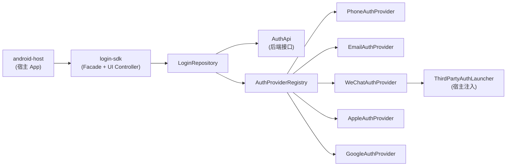

# Kuikly Login SDK 技术预演 — 接入文档

> 版本：0.2.0-preview  
> 适用：Android + iOS 移动端（不含 H5），多 App 独立依赖同一登录 SDK  
> 工程路径：`kuikly-login-sdk-demo`

---

## 1. 概述

本预演工程演示如何将**登录能力**从宿主 App 中解耦为独立 SDK，并预留 Kuikly 跨端扩展能力。

### 1.1 设计目标

| 目标 | 实现方式 |
|------|----------|
| 独立 SDK + 内置登录 UI | `login-sdk` 内置 `LoginActivity` / iOS Presenter，`launchLogin()` 一键拉起 |
| 多 App 复用 | 各 App `implementation(login-sdk)`，分别 `init` + `launchLogin` |
| 登录方式可扩展 | `AuthProvider` 策略模式，五种方式独立实现 |
| UI 与业务解耦 | `LoginUiContract` + 跨端 `SharedLoginScreen` / `LoginSdkApp` |
| 跨端 UI 共享 | Compose Multiplatform（类似 Flutter 一套 UI 多端运行） |
| 与 Kuikly 兼容 | UI 层可替换为 Kuikly Page，控制器/API 不变 |

### 1.2 支持的登录方式

| 方式 | AuthMethod | 平台 | 说明 |
|------|------------|------|------|
| 手机号 + 验证码 | `PHONE` | 全平台 | common 层实现 |
| 邮箱 + 密码 | `EMAIL` | 全平台 | common 层实现 |
| 微信 | `WECHAT` | Android / iOS | 平台 SDK + `ThirdPartyAuthLauncher` |
| Apple ID | `APPLE_ID` | iOS 原生；Android Web OAuth | 平台 SDK |
| Google | `GOOGLE` | Android / iOS | Google Sign-In / Credential Manager |

---

## 2. 工程结构

```
kuikly-login-sdk-demo/
├── login-sdk/                    # 登录 SDK（KMP，含内置登录 UI）
│   └── src/
│       ├── commonMain/           # API、Repository、LoginUiContract
│       ├── androidMain/          # LoginActivity、Providers
│       └── iosMain/              # LoginComposeScreen、Providers
│   └── commonMain/.../ui/
│       ├── LoginScreen.kt        # ★ Android / iOS 共用登录 UI
│       └── LoginSdkTheme.kt
├── android-host/                 # Android Demo 宿主
├── ios-host/                     # iOS Demo 宿主（ios-host.xcodeproj）
└── docs/
    ├── DISTRIBUTION.md           # 分发与多端依赖（技术预研）
    ├── INTEGRATION.md            # 本文档（接入）
    ├── DEVELOPMENT.md            # 开发文档（维护 SDK）
    ├── ARCHITECTURE.md
    ├── PERFORMANCE.md
    └── THIRD_PARTY_AUTH.md
```

### 2.1 模块依赖关系



---

## 3. 快速开始（Android）

### 3.1 环境要求

- Android Studio Ladybug+ 
- JDK 17
- Kotlin 2.0.21
- Gradle 8.11+

### 3.2 运行 Demo

```bash
cd kuikly-login-sdk-demo

# 首次需要生成 wrapper（若缺失）
gradle wrapper

# 编译并安装 Demo
./gradlew :android-host:installDebug
```

Demo 验证数据：

- 手机号：`13800138000`，验证码：`123456`
- 邮箱：`demo@example.com`，密码：`123456`（至少 6 位）
- 微信 / Apple / Google：点击即模拟授权成功

### 3.3 宿主 App 最小接入（3 步）

#### Step 1：添加依赖

```kotlin
// settings.gradle.kts
include(":login-sdk")

// app/build.gradle.kts
dependencies {
    implementation(project(":login-sdk"))
    // 或正式环境：
    // implementation("com.yourcompany:login-sdk:0.2.0")
}
```

> SDK 的 `AndroidManifest.xml` 会自动合并 `LoginActivity`，宿主**无需**再声明登录页。

#### Step 2：Application 初始化（Android）

```kotlin
import com.example.login.sdk.api.init

class MyApp : Application() {
    override fun onCreate() {
        super.onCreate()
        LoginSDK.init(
            context = this,
            config = LoginConfig(
                appId = "your-app-id",
                providers = createAndroidAuthProviders(
                    launcher = YourThirdPartyAuthLauncher(this),
                    isWeChatInstalled = { WeChatSdk.isInstalled() },
                ),
                // authApi = KtorAuthApi("https://api.yourapp.com"),
                // tokenStore = SecureTokenStore(this),
                theme = LoginTheme(primaryColor = 0xFF1976D2),
                featureConfig = AuthFeatureConfig(
                    showLogin = true,
                    showRegister = true,
                    showForgotPassword = false,  // 某 App 可关闭找回密码
                    showThirdPartyAuth = true,
                ),
            ),
        )
    }
}
```

`AuthFeatureConfig` 控制账号页 Tab 与入口显隐：

| 字段 | 说明 |
|------|------|
| `showLogin` | 显示登录流程 |
| `showRegister` | 显示注册流程 |
| `showForgotPassword` | 显示找回密码 |
| `showPhoneAuth` / `showEmailAuth` | 手机 / 邮箱表单 |
| `showThirdPartyAuth` | 微信 / Apple / Google（仅登录、注册 Tab 展示） |
| `defaultFlow` | 打开页面默认流程（需在 `enabledFlows` 内） |

#### Step 3：拉起登录 / 检查会话

```kotlin
// 推荐：使用 SDK 内置登录页
LoginSDK.launchLogin(object : LoginCallback {
    override fun onSuccess(session: LoginSession) {
        // 进入业务 / 个人中心
    }
    override fun onError(error: LoginError) { }
    override fun onCancel() { }
})

// 或先检查登录态
if (LoginSDK.isLoggedIn()) {
    val session = LoginSDK.currentSession()
} else {
    LoginSDK.launchLogin(callback)
}

// 退出
lifecycleScope.launch { LoginSDK.logout() }
```

### 3.4 多 App 接入说明

多个 App（个人中心、业务 App A/B/C）均可独立依赖同一 `login-sdk`：

| 步骤 | 说明 |
|------|------|
| 1 | 各 App `implementation(login-sdk)` |
| 2 | 各 App `Application` 中 `LoginSDK.init(context, config)` |
| 3 | 需要登录时 `LoginSDK.launchLogin(callback)` |
| 4 | 按需配置 `appId`、`theme`、`tokenStore`；**锁定同一 SDK 版本** |

若个人中心 App 同时作为 **Token 中台**（ContentProvider 向其他 App 分发 Token），见 [DEVELOPMENT.md §7](./DEVELOPMENT.md#7-与账号中台token-broker的关系)（规划中的 `account-broker` 模块，与 login-sdk 解耦）。

### 3.5 iOS 接入

```kotlin
// App 启动 — 与 Android 共用同一套 LoginScreen（Compose Multiplatform）
LoginSDK.init(LoginConfig(appId = "...", providers = createIosAuthProviders()))

LoginSDK.installIosLoginUi {
    // 返回当前 window 的 rootViewController
    window.rootViewController!!
}

// 业务处与 Android 完全相同
LoginSDK.launchLogin(callback)

// 或嵌入自有导航栈
val loginVc = LoginSDK.createLoginViewController(callback) { /* dismissed */ }
```

> Android 与 iOS 登录 UI 源码均为 `login-sdk/src/commonMain/.../ui/LoginScreen.kt`，视觉与交互一致。

### 3.6 运行 iOS Demo（ios-host）

**推荐 Xcode**（Mac）：

1. `gradle wrapper`（首次）
2. 打开 `ios-host/ios-host.xcodeproj`
3. 选择 iPhone 模拟器 → **Run**
4. 首次构建会自动执行 Gradle `embedAndSignAppleFrameworkForXcode`

完整说明：[ios-host/README.md](../ios-host/README.md)

---

## 4. SDK 公开 API

### 4.1 LoginSDK（Facade）

| 方法 | 说明 |
|------|------|
| `init(context, config)` | **Android**：初始化，须传 `Context` |
| `init(config)` | **iOS / 通用**：初始化 |
| `installIosLoginUi { rootVc }` | **iOS**：注册 root VC，启用内置跨端登录 UI |
| `createLoginViewController(callback)` | **iOS**：创建登录 VC（嵌入导航时） |
| `setIosLoginPresenter { }` | **iOS**：自定义登录页容器（高级） |
| `launchLogin(callback)` | **推荐**：拉起 SDK 内置登录页 |
| `registerProvider(provider)` | 动态注册/替换 Provider |
| `availableMethods()` | 当前平台可用登录方式 |
| `isLoggedIn()` | 是否已登录 |
| `currentSession()` | 当前会话 |
| `login(method, credentials)` | 编程式登录（无 UI） |
| `register(method, credentials)` | 编程式注册 |
| `resetPassword(method, credentials)` | 编程式找回密码 |
| `sendVerificationCode(method, target)` | 发送验证码 |
| `logout()` | 退出 |
| `refreshToken()` | 刷新 Token |
| `createLoginController(callback)` | 创建 UI 控制器（宿主自绘 UI 时使用） |

### 4.2 LoginCallback

```kotlin
interface LoginCallback {
    fun onSuccess(session: LoginSession)
    fun onError(error: LoginError)
    fun onCancel()
}
```

### 4.3 LoginUiContract（UI 层接口）

View / Kuikly Page 只依赖此接口：

```kotlin
interface LoginUiContract {
    val state: StateFlow<LoginUiState>
    fun selectMethod(method: AuthMethod)
    fun updatePhone(phone: String)
    fun updateEmail(email: String)
    fun updatePassword(password: String)
    fun updateVerificationCode(code: String)
    fun sendCode()
    fun login()
    fun loginWithThirdParty(method: AuthMethod)
    fun dismissError()
}
```

---

## 5. 解耦设计说明

### 5.1 分层职责

```
┌─────────────────────────────────────────────┐
│  宿主 App（android-host / iosApp / ohosApp）  │
│  - 导航 / Tab / 系统权限 / 第三方 SDK 回调    │
└──────────────────┬──────────────────────────┘
                   │ LoginSDK.init / Callback
┌──────────────────▼──────────────────────────┐
│  login-sdk/api（Facade + UiController）       │
│  - 对外稳定 API，内部实现可替换               │
└──────────────────┬──────────────────────────┘
                   │
┌──────────────────▼──────────────────────────┐
│  login-sdk/internal（Repository）            │
│  - 编排 Provider + AuthApi + TokenStore      │
└───────┬──────────────────────┬──────────────┘
        │                      │
┌───────▼────────┐    ┌────────▼─────────────┐
│ AuthProvider   │    │ AuthApi（后端接口）    │
│ 各登录方式策略  │    │ 可替换 Mock/真实实现   │
└────────────────┘    └──────────────────────┘
```

### 5.2 扩展新登录方式

1. 在 `AuthMethod` 枚举添加新值
2. 实现 `AuthProvider` 接口
3. `LoginSDK.registerProvider(YourProvider())` 或在 `LoginConfig.providers` 中注册
4. UI 层添加按钮，调用 `loginWithThirdParty(YourMethod)`

**无需修改 Repository 或 Facade 内部逻辑。**

### 5.3 替换后端 API

实现 `AuthApi` 接口：

```kotlin
class KtorAuthApi(private val baseUrl: String) : AuthApi {
    override suspend fun loginWithPhone(phone: String, code: String): Result<LoginSession> {
        // POST /auth/phone/login
    }
    // ...
}

LoginSDK.init(LoginConfig(appId = "...", authApi = KtorAuthApi("https://api.example.com")))
```

---

## 6. Kuikly 正式接入路径

当前 Demo 的登录 UI 在 **`login-sdk/commonMain`**，通过 Compose Multiplatform 跨端共享。Android / iOS / Web 宿主仅挂载 `LoginSdkApp()`。

### 6.1 UI 迁移

| 现在（预演） | 正式（Kuikly） |
|-------------|---------------|
| `LoginSdkApp` + CMP 跨端 Compose | `@Page` + Kuikly `ComposeContainer` |
| `SharedLoginScreen` 在 commonMain | 同一 Composable，换 Kuikly 容器 |
| `LoginUiContract` | **保持不变** |

### 6.2 宿主容器接入

**Android — Activity 容器：**

```kotlin
// 参考 Kuikly 官方文档
val intent = Intent(this, KuiklyRenderActivity::class.java)
intent.putExtra("pageName", "login")  // 对应 @Page("login")
startActivity(intent)
```

**Android — View 嵌入（Fragment / Dialog）：**

```kotlin
val kuiklyView = KuiklyBaseView(context, delegate)
kuiklyView.onAttach("", "login", mapOf())
rootView.addView(kuiklyView)
// 生命周期：onResume/onPause/onDetach 需手动转发
```

**iOS / 鸿蒙：** 参考 [Kuikly iOS 接入](https://kuikly.tds.qq.com/QuickStart/iOS.html) / [鸿蒙接入](https://kuikly.tds.qq.com/QuickStart/harmony.html)

### 6.3 推荐演进路线

```
Phase 1（当前）  Android Jetpack Compose UI + KMP SDK 逻辑
Phase 2          登录页 UI 迁移至 Kuikly Page，SDK API 不变
Phase 3          发布 login-sdk AAR + XCFramework，iOS/鸿蒙宿主接入
Phase 4          个人中心页面逐步迁移 Kuikly，原生仅保留壳
```

---

## 7. SDK 发布与多端依赖

> **完整预研说明**（Git 依赖、Submodule、AAR/XCFramework、CI 发布、Windows/Mac 差异）：见 **[DISTRIBUTION.md](./DISTRIBUTION.md)**

### 7.1 预研结论（摘要）

- **不能**用单一 Git URL 同时依赖 Android + iOS；**可以**用 Git 管理源码，各端消费 **不同格式产物**。  
- **开发期最简单**：`implementation(project(":login-sdk"))` 或 **Git Submodule**。  
- **正式给多 App**：同一版本 **AAR（Android）+ XCFramework（iOS）**，推荐 **Git Tag + CI** 一次打出双产物。

### 7.2 Android AAR

```bash
./gradlew :login-sdk:assembleRelease
# 产物：login-sdk/build/outputs/aar/login-sdk-release.aar
```

```kotlin
implementation(files("libs/login-sdk-release.aar"))
// 或：implementation("com.yourcompany:login-sdk:0.2.0")
```

### 7.3 iOS XCFramework

```bash
./gradlew :login-sdk:assembleLoginSdkReleaseXCFramework
```

Xcode 嵌入 `login-sdk.xcframework`，或使用 CocoaPods `pod 'LoginSDK', '0.2.0'`。详见 [DISTRIBUTION.md §4.3](./DISTRIBUTION.md#43-ios-宿主依赖-xcframework)。

### 7.4 对外交付清单

| 交付物 | 说明 |
|--------|------|
| `login-sdk-release.aar` | Android SDK |
| `LoginSDK` API 文档 | 本文档 §4 |
| `ThirdPartyAuthLauncher` 接入说明 | 见 `THIRD_PARTY_AUTH.md` |
| ProGuard 规则 | 见 `login-sdk/proguard-rules.pro` |
| Demo 工程 | `android-host` |

---

## 8. 个人中心与登录 SDK 的关系

```
┌──────────────────────────────────────┐
│           宿主 App                    │
│  ┌─────────────┐  ┌────────────────┐ │
│  │ 个人中心     │  │  login-sdk     │ │
│  │ (原生/Kuikly)│  │  - 登录 UI      │ │
│  │ - 资料编辑   │  │  - Token 管理   │ │
│  │ - 设置       │  │  - 会话状态     │ │
│  └──────┬──────┘  └───────┬────────┘ │
│         │    LoginSDK     │          │
│         └──────session────┘          │
└──────────────────────────────────────┘
```

- **个人中心**：宿主自有模块，读取 `LoginSDK.currentSession()` 展示用户信息
- **登录 SDK**：独立模块，只负责鉴权，不耦合个人中心 UI
- **共享数据**：`LoginSession` + `TokenStore`

---

## 9. 性能对比（vs Flutter / H5）

登录 SDK 场景下，Kuikly/KMP 路线在**包体、冷启动、交互响应、内存**方面通常优于 Flutter Module 和 H5 WebView SDK；跨端 UI 一致性上 Flutter / H5 更强，但登录页场景收益有限。

**核心结论：**

| 方案 | 优势 | 劣势 |
|------|------|------|
| **Kuikly / KMP** | 原生渲染、体积小、启动快、鸿蒙支持好 | 生态小于 Flutter；**本工程暂无 Web target** |
| **Flutter Module** | UI 一致性最好；**含 Flutter Web** | Engine 重（+3~8MB），嵌入多宿主包体惩罚大 |
| **H5 WebView** | 体积最小、H5 团队零学习成本；**Web 站点天然支持** | 启动慢、交互差、第三方回调不稳定 |

详细对比（含平台覆盖矩阵、评分表、Benchmark 计划）：见 **[PERFORMANCE.md](./PERFORMANCE.md)**

---

## 10. 常见问题

### Q1：前期只做 Android，后期加 iOS 改动大吗？

不大。`commonMain` 的 Repository、UI 状态、API 全部复用。iOS 只需：
1. 实现 iOS 版 `AuthProvider`（微信/Apple/Google）
2. 接入 Kuikly Render
3. 宿主调用相同的 `LoginSDK.init()` / `createLoginController()`

### Q2：能否只接入 SDK 逻辑，UI 自己写？

可以。不使用 `LoginUiContract`，直接调用：

```kotlin
lifecycleScope.launch {
    val result = LoginSDK.login(AuthMethod.PHONE, LoginCredentials.PhoneOtp(phone, code))
    when (result) {
        is AuthResult.Success -> // 处理
        is AuthResult.Failure -> // 错误
        AuthResult.Cancelled -> // 取消
    }
}
```

### Q3：第三方登录如何处理 Activity 回调？

通过 `ThirdPartyAuthLauncher` 注入，SDK 不持有 Activity 引用。详见 `THIRD_PARTY_AUTH.md`。

### Q4：Token 存在哪里？

默认 `InMemoryTokenStore`（进程内）。生产环境实现 `TokenStore` 接口，使用 EncryptedSharedPreferences（Android）/ Keychain（iOS）。

### Q5：Web 端能否直接接入本 SDK？

**当前不能。** `login-sdk` 未配置 KMP Web target，也无 npm / JS 产物。可选路径：

1. **独立 Web Login SDK**（TS/JS），与 KMP 共用同一套 `AuthApi` 后端协议；
2. **宿主 App 内嵌 H5 登录页**（WebView + JSBridge 回传 `LoginSession`）；
3. 中长期等 **Kuikly Web** 成熟后，再与 `LoginUiContract` 对齐。

详见 [PERFORMANCE.md §2.1](./PERFORMANCE.md#21-平台覆盖范围选型维度)。

### Q6：Flutter 能否达到同样能力？

**可以。** Flutter 在 Android / iOS / **Web 浏览器** 上更成熟，适合做「一套 UI 跨 App + Web」。差异在于：Flutter Engine 包体更大、冷启动略慢；嵌入多个原生宿主时惩罚更明显。本工程选 KMP/Kuikly 是偏重**轻量原生嵌入 + 鸿蒙**，而非 Flutter 做不到。对比见 [PERFORMANCE.md](./PERFORMANCE.md)。

---

## 11. 参考链接

- [Kuikly 官方文档](https://kuikly.tds.qq.com/)
- [Kuikly Android 工程接入](https://kuikly.tds.qq.com/QuickStart/android.html)
- [Kuikly GitHub](https://github.com/Tencent-TDS/KuiklyUI)
- 本工程架构详解：`docs/ARCHITECTURE.md`
- 多 App 多栈方案：`docs/MULTI_APP_ARCHITECTURE.md`
- SDK 开发维护：`docs/DEVELOPMENT.md`
- 性能对比分析：`docs/PERFORMANCE.md`
- SDK 分发与多端依赖：`docs/DISTRIBUTION.md`
- 第三方登录接入：`docs/THIRD_PARTY_AUTH.md`
