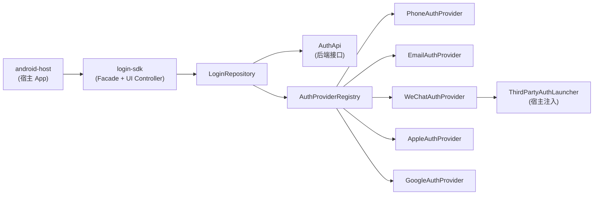

# Kuikly Login SDK 技术预演 — 接入文档

> 版本：0.1.0-preview  
> 适用：Android 先行，后期扩展 iOS / 鸿蒙 / Web  
> 工程路径：`/Users/a1-6/projects/kuikly-login-sdk-demo`

---

## 1. 概述

本预演工程演示如何将**登录能力**从宿主 App 中解耦为独立 SDK，并预留 Kuikly 跨端扩展能力。

### 1.1 设计目标

| 目标 | 实现方式 |
|------|----------|
| 前期 Android 为主 | `android-host` 壳工程 + `login-sdk` AAR |
| 后期多端复用 | `login-sdk` 为 KMP 模块，`commonMain` 共享 UI 状态与业务逻辑 |
| 登录方式可扩展 | `AuthProvider` 策略模式，五种方式独立实现 |
| UI 与业务解耦 | `LoginUiContract` 控制器 + `LoginSDK` Facade |
| 与 Kuikly 兼容 | UI 层可替换为 Kuikly Page，控制器/API 不变 |

### 1.2 支持的登录方式

| 方式 | AuthMethod | 平台 | 说明 |
|------|------------|------|------|
| 手机号 + 验证码 | `PHONE` | 全平台 | common 层实现 |
| 邮箱 + 密码 | `EMAIL` | 全平台 | common 层实现 |
| 微信 | `WECHAT` | Android / iOS | 平台 SDK + `ThirdPartyAuthLauncher` |
| Apple ID | `APPLE_ID` | iOS 原生；Android Web OAuth | 平台 SDK |
| Google | `GOOGLE` | Android / iOS | Google Sign-In / Credential Manager |

---

## 2. 工程结构

```
kuikly-login-sdk-demo/
├── login-sdk/                    # 登录 SDK（KMP 模块，后期发 AAR / XCFramework）
│   └── src/
│       ├── commonMain/           # 共享：API、Repository、UI 状态、通用 Provider
│       ├── androidMain/            # Android 第三方 Provider 实现
│       └── iosMain/                # iOS Provider 占位（正式接入时补全）
├── android-host/                   # Android 宿主 Demo（个人中心 + 登录页）
└── docs/                           # 文档
    ├── INTEGRATION.md              # 本文档
    ├── ARCHITECTURE.md             # 架构详解
    └── THIRD_PARTY_AUTH.md         # 第三方登录接入指南
```

### 2.1 模块依赖关系



---

## 3. 快速开始（Android）

### 3.1 环境要求

- Android Studio Ladybug+ 
- JDK 17
- Kotlin 2.0.21
- Gradle 8.11+

### 3.2 运行 Demo

```bash
cd /Users/a1-6/projects/kuikly-login-sdk-demo

# 首次需要生成 wrapper（若缺失）
gradle wrapper

# 编译并安装 Demo
./gradlew :android-host:installDebug
```

Demo 验证数据：

- 手机号：`13800138000`，验证码：`123456`
- 邮箱：`demo@example.com`，密码：`123456`（至少 6 位）
- 微信 / Apple / Google：点击即模拟授权成功

### 3.3 宿主 App 最小接入（3 步）

#### Step 1：添加依赖

```kotlin
// settings.gradle.kts
include(":login-sdk")

// app/build.gradle.kts
dependencies {
    implementation(project(":login-sdk"))
    // 正式 Kuikly 接入时额外添加：
    // implementation("com.tencent.kuikly-open:core-render-android:x.x.x")
}
```

#### Step 2：Application 初始化

```kotlin
class MyApp : Application() {
    override fun onCreate() {
        super.onCreate()
        LoginSDK.init(
            LoginConfig(
                appId = "your-app-id",
                providers = createAndroidAuthProviders(
                    launcher = YourThirdPartyAuthLauncher(this),
                    isWeChatInstalled = { WeChatSdk.isInstalled() },
                ),
                // authApi = KtorAuthApi("https://api.yourapp.com"), // 替换 Mock
                // tokenStore = SecureTokenStore(this),
            )
        )
    }
}
```

#### Step 3：触发登录 / 检查会话

```kotlin
// 检查登录态
if (!LoginSDK.isLoggedIn()) {
    startActivity(Intent(this, LoginActivity::class.java))
} else {
    val session = LoginSDK.currentSession()
    // 进入个人中心
}

// 退出
lifecycleScope.launch { LoginSDK.logout() }
```

---

## 4. SDK 公开 API

### 4.1 LoginSDK（Facade）

| 方法 | 说明 |
|------|------|
| `init(config)` | 初始化，App 启动时调用一次 |
| `registerProvider(provider)` | 动态注册/替换 Provider |
| `availableMethods()` | 当前平台可用登录方式 |
| `isLoggedIn()` | 是否已登录 |
| `currentSession()` | 当前会话 |
| `login(method, credentials)` | 编程式登录 |
| `sendVerificationCode(method, target)` | 发送验证码 |
| `logout()` | 退出 |
| `refreshToken()` | 刷新 Token |
| `createLoginController(callback)` | 创建 UI 控制器 |

### 4.2 LoginCallback

```kotlin
interface LoginCallback {
    fun onSuccess(session: LoginSession)
    fun onError(error: LoginError)
    fun onCancel()
}
```

### 4.3 LoginUiContract（UI 层接口）

View / Kuikly Page 只依赖此接口：

```kotlin
interface LoginUiContract {
    val state: StateFlow<LoginUiState>
    fun selectMethod(method: AuthMethod)
    fun updatePhone(phone: String)
    fun updateEmail(email: String)
    fun updatePassword(password: String)
    fun updateVerificationCode(code: String)
    fun sendCode()
    fun login()
    fun loginWithThirdParty(method: AuthMethod)
    fun dismissError()
}
```

---

## 5. 解耦设计说明

### 5.1 分层职责

```
┌─────────────────────────────────────────────┐
│  宿主 App（android-host / iosApp / ohosApp）  │
│  - 导航 / Tab / 系统权限 / 第三方 SDK 回调    │
└──────────────────┬──────────────────────────┘
                   │ LoginSDK.init / Callback
┌──────────────────▼──────────────────────────┐
│  login-sdk/api（Facade + UiController）       │
│  - 对外稳定 API，内部实现可替换               │
└──────────────────┬──────────────────────────┘
                   │
┌──────────────────▼──────────────────────────┐
│  login-sdk/internal（Repository）            │
│  - 编排 Provider + AuthApi + TokenStore      │
└───────┬──────────────────────┬──────────────┘
        │                      │
┌───────▼────────┐    ┌────────▼─────────────┐
│ AuthProvider   │    │ AuthApi（后端接口）    │
│ 各登录方式策略  │    │ 可替换 Mock/真实实现   │
└────────────────┘    └──────────────────────┘
```

### 5.2 扩展新登录方式

1. 在 `AuthMethod` 枚举添加新值
2. 实现 `AuthProvider` 接口
3. `LoginSDK.registerProvider(YourProvider())` 或在 `LoginConfig.providers` 中注册
4. UI 层添加按钮，调用 `loginWithThirdParty(YourMethod)`

**无需修改 Repository 或 Facade 内部逻辑。**

### 5.3 替换后端 API

实现 `AuthApi` 接口：

```kotlin
class KtorAuthApi(private val baseUrl: String) : AuthApi {
    override suspend fun loginWithPhone(phone: String, code: String): Result<LoginSession> {
        // POST /auth/phone/login
    }
    // ...
}

LoginSDK.init(LoginConfig(appId = "...", authApi = KtorAuthApi("https://api.example.com")))
```

---

## 6. Kuikly 正式接入路径

当前 Demo 的 `LoginActivity` 使用 Android 原生 XML 渲染 UI。迁移到 Kuikly 时：

### 6.1 UI 迁移

| 现在（预演） | 正式（Kuikly） |
|-------------|---------------|
| `LoginActivity` + XML | `@Page` Kuikly Compose Page |
| `lifecycleScope.collect` | Kuikly 响应式绑定 |
| `LoginUiContract` | **保持不变** |

### 6.2 宿主容器接入

**Android — Activity 容器：**

```kotlin
// 参考 Kuikly 官方文档
val intent = Intent(this, KuiklyRenderActivity::class.java)
intent.putExtra("pageName", "login")  // 对应 @Page("login")
startActivity(intent)
```

**Android — View 嵌入（Fragment / Dialog）：**

```kotlin
val kuiklyView = KuiklyBaseView(context, delegate)
kuiklyView.onAttach("", "login", mapOf())
rootView.addView(kuiklyView)
// 生命周期：onResume/onPause/onDetach 需手动转发
```

**iOS / 鸿蒙：** 参考 [Kuikly iOS 接入](https://kuikly.tds.qq.com/QuickStart/iOS.html) / [鸿蒙接入](https://kuikly.tds.qq.com/QuickStart/harmony.html)

### 6.3 推荐演进路线

```
Phase 1（当前）  Android 原生 UI + KMP SDK 逻辑
Phase 2          登录页 UI 迁移至 Kuikly Page，SDK API 不变
Phase 3          发布 login-sdk AAR + XCFramework，iOS/鸿蒙宿主接入
Phase 4          个人中心页面逐步迁移 Kuikly，原生仅保留壳
```

---

## 7. SDK 发布

### 7.1 Android AAR

```bash
./gradlew :login-sdk:assembleRelease
# 产物：login-sdk/build/outputs/aar/login-sdk-release.aar
```

宿主依赖：

```kotlin
implementation(files("libs/login-sdk-release.aar"))
// 或发布到 Maven Private
```

### 7.2 iOS XCFramework（后期）

```bash
./gradlew :login-sdk:assembleLoginSdkReleaseXCFramework
```

### 7.3 对外交付清单

| 交付物 | 说明 |
|--------|------|
| `login-sdk-release.aar` | Android SDK |
| `LoginSDK` API 文档 | 本文档 §4 |
| `ThirdPartyAuthLauncher` 接入说明 | 见 `THIRD_PARTY_AUTH.md` |
| ProGuard 规则 | 见 `login-sdk/proguard-rules.pro` |
| Demo 工程 | `android-host` |

---

## 8. 个人中心与登录 SDK 的关系

```
┌──────────────────────────────────────┐
│           宿主 App                    │
│  ┌─────────────┐  ┌────────────────┐ │
│  │ 个人中心     │  │  login-sdk     │ │
│  │ (原生/Kuikly)│  │  - 登录 UI      │ │
│  │ - 资料编辑   │  │  - Token 管理   │ │
│  │ - 设置       │  │  - 会话状态     │ │
│  └──────┬──────┘  └───────┬────────┘ │
│         │    LoginSDK     │          │
│         └──────session────┘          │
└──────────────────────────────────────┘
```

- **个人中心**：宿主自有模块，读取 `LoginSDK.currentSession()` 展示用户信息
- **登录 SDK**：独立模块，只负责鉴权，不耦合个人中心 UI
- **共享数据**：`LoginSession` + `TokenStore`

---

## 9. 常见问题

### Q1：前期只做 Android，后期加 iOS 改动大吗？

不大。`commonMain` 的 Repository、UI 状态、API 全部复用。iOS 只需：
1. 实现 iOS 版 `AuthProvider`（微信/Apple/Google）
2. 接入 Kuikly Render
3. 宿主调用相同的 `LoginSDK.init()` / `createLoginController()`

### Q2：能否只接入 SDK 逻辑，UI 自己写？

可以。不使用 `LoginUiContract`，直接调用：

```kotlin
lifecycleScope.launch {
    val result = LoginSDK.login(AuthMethod.PHONE, LoginCredentials.PhoneOtp(phone, code))
    when (result) {
        is AuthResult.Success -> // 处理
        is AuthResult.Failure -> // 错误
        AuthResult.Cancelled -> // 取消
    }
}
```

### Q3：第三方登录如何处理 Activity 回调？

通过 `ThirdPartyAuthLauncher` 注入，SDK 不持有 Activity 引用。详见 `THIRD_PARTY_AUTH.md`。

### Q4：Token 存在哪里？

默认 `InMemoryTokenStore`（进程内）。生产环境实现 `TokenStore` 接口，使用 EncryptedSharedPreferences（Android）/ Keychain（iOS）。

---

## 10. 参考链接

- [Kuikly 官方文档](https://kuikly.tds.qq.com/)
- [Kuikly Android 工程接入](https://kuikly.tds.qq.com/QuickStart/android.html)
- [Kuikly GitHub](https://github.com/Tencent-TDS/KuiklyUI)
- 本工程架构详解：`docs/ARCHITECTURE.md`
- 第三方登录接入：`docs/THIRD_PARTY_AUTH.md`
