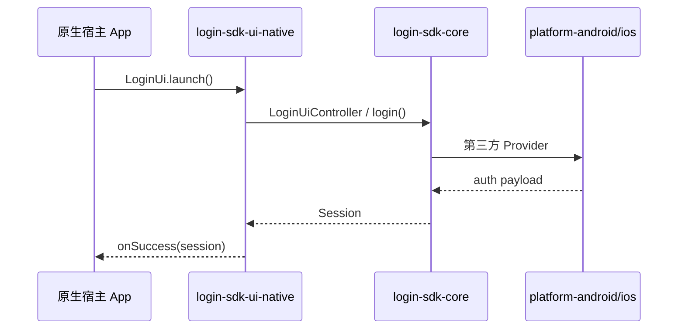
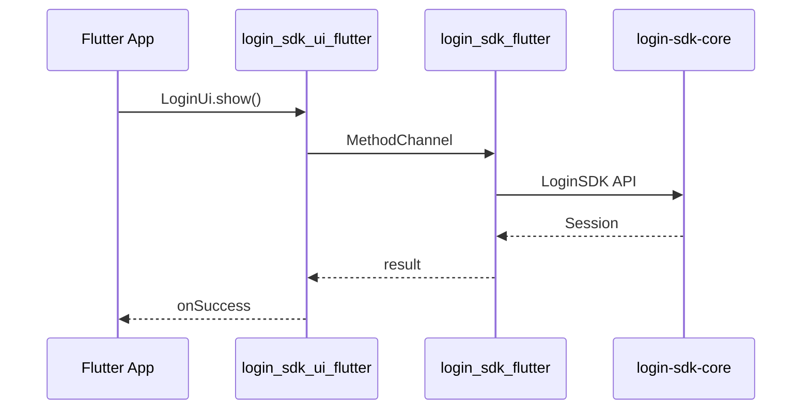

# 多 App 多技术栈 — 登录 SDK 架构方案

> **文档类型**：技术方案 · 多宿主接入  
> **版本**：1.0  
> **读者**：架构评审、移动端负责人、Flutter / 原生开发  
> **关联**：[INTEGRATION.md](./INTEGRATION.md) · [ARCHITECTURE.md](./ARCHITECTURE.md) · [PERFORMANCE.md](./PERFORMANCE.md)

---

## 1. 背景与目标

### 1.1 现状

| 现状 | 说明 |
|------|------|
| 多个 App | 个人中心、工具类、社交等，技术栈不统一 |
| 技术栈混杂 | **Android 原生**、**iOS 原生**、**Flutter** 并存 |
| 登录能力需复用 | 同一套账号体系、Session、第三方登录（微信 / Apple / Google） |
| 售卖形态 | 业务 SDK 可单独卖；UI SDK 可选；也可组合 |

### 1.2 目标

1. **登录业务只写一次**（KMP）  
2. **UI 按宿主栈提供**，不强行一套 UI 覆盖 Flutter + 原生  
3. **core + ui 可组合**，也可 **只用 core、不用官方 UI**  
4. **原生 App 不为登录引入 Flutter Engine**  
5. **其他业务**（个人中心等）复用同一分层模式  

---

## 2. 核心结论（先读这段）

| 问题 | 结论 |
|------|------|
| 登录 UI 要写三套吗？ | **不用**。原生 Android + iOS **共用 1 套 CMP**；Flutter App **另 1 套 Widget**。最多 **2 套官方 UI**，不是 3 套 |
| 业务写几遍？ | **1 遍**（KMP `login-sdk-core`） |
| Flutter App 能用 Flutter UI + KMP 业务吗？ | **可以**（Plugin 链 core） |
| 原生 App 能用 Flutter 做登录 UI 吗？ | **不推荐**（Engine +3~8MB，见 [PERFORMANCE.md](./PERFORMANCE.md)） |
| 其他业务怎么办？ | 同一模式：**xxx-sdk-core（KMP）+ ui-native / ui-flutter**；Session 走 **account-core** |

**推荐方案：混合方案 C**

```text
login-sdk-core (KMP)                    ← 业务 SDK，可单独对外
    ├── login-sdk-platform-android/ios   ← 平台三方 SDK（微信/Google/存储）
    ├── login-sdk-ui-native (CMP)        ← 原生 App 登录 UI（Android+iOS 一份）
    └── login_sdk_flutter (+ ui)         ← Flutter App（Plugin + Widget）
```

---

## 3. 双 SDK 产品形态

### 3.1 两个 SDK 的关系

```text
┌─────────────────────────────────────────────────────────┐
│  login-sdk-core（业务 SDK）                              │
│  LoginSDK / Repository / Session / Provider 接口         │
│  无 UI、无微信/Google 等重型 Native 依赖                  │
│  ✅ 可单独使用                                           │
└───────────────────────────┬─────────────────────────────┘
                            │ UI SDK 必须依赖 core
        ┌───────────────────┼───────────────────┐
        ▼                   ▼                   ▼
┌───────────────┐  ┌───────────────┐  ┌─────────────────┐
│ ui-native     │  │ ui-flutter    │  │ 宿主自绘 UI      │
│ CMP 登录组件   │  │ Widget 登录页  │  │ 只调 core API   │
│ Android+iOS   │  │ 仅 Flutter    │  │ 不买 UI SDK     │
└───────────────┘  └───────────────┘  └─────────────────┘
```

### 3.2 使用模式

| 模式 | 依赖 | 典型代码 |
|------|------|----------|
| **A. UI + 业务** | core + ui-* + platform-* | `LoginUi.launch()` / `LoginUiFlutter.show()` |
| **B. 仅业务** | core + platform-* | `LoginSDK.login(PHONE, credentials)` |
| **C. 聚合包** | `login-sdk` = core + ui-native + platform | 一行依赖，开箱即用 |

### 3.3 core 对外 API（UI 与宿主共用）

```kotlin
// 初始化
LoginSDK.init(LoginConfig(appId, authApi, platformModule))

// 模式 B：无 UI
suspend fun login(method, credentials): AuthResult
fun currentSession(): LoginSession?
suspend fun logout()

// 模式 A：有 UI（ui-native / ui-flutter 内部同样调 core）
LoginUi.launch(context, LoginUiOptions(...), callback)
```

---

## 4. 模块拆分与协作

### 4.1 模块一览

| 模块 | 类型 | 职责 | 可单独发布 |
|------|------|------|------------|
| `login-sdk-api` | KMP common | 模型、错误码、接口（可选） | 可选 |
| **`login-sdk-core`** | KMP | 业务唯一实现 | ✅ 业务 SDK |
| `login-sdk-platform-android` | Android | 微信/Google/EncryptedSP | 按需 |
| `login-sdk-platform-ios` | iOS | Apple/微信/Keychain | 按需 |
| **`login-sdk-ui-native`** | KMP + CMP | 跨端登录 UI | ✅ UI SDK |
| `login_sdk_flutter` | Plugin | Channel → core | Flutter 客户 |
| `login_sdk_ui_flutter` | Dart | Flutter 登录 Widget | 可选 |
| `login-sdk` | 聚合 | core + ui + platform | 懒人包 |

### 4.2 依赖关系

```text
login-sdk-api (可选)
       │
login-sdk-core  ← 不依赖任何三方 SDK
       │
       ├── login-sdk-platform-android  (implementation 微信/Google...)
       ├── login-sdk-platform-ios
       │
       ├── login-sdk-ui-native  (api core + Compose MP，无微信 SDK)
       │
       └── login_sdk_flutter  (内嵌 core 二进制)

android-host / ios-host:
  ui-native + platform-* + account-core（个人中心读 Session）
```

### 4.3 Gradle 依赖示意

```kotlin
// 仅业务 + 自绘 UI
implementation("com.company:login-sdk-core:1.x")
implementation("com.company:login-sdk-platform-android:1.x")

// UI + 业务（原生 App）
implementation("com.company:login-sdk-ui-native:1.x")
implementation("com.company:login-sdk-platform-android:1.x")

// 聚合
implementation("com.company:login-sdk:1.x")
```

---

## 5. 多 App 接入矩阵

| 宿主 App | 业务 | 登录 UI | 平台插件 | 说明 |
|----------|------|---------|----------|------|
| **Android 原生** | core | ui-native **或** 自绘 | platform-android | 不要 Flutter Module |
| **iOS 原生** | core | ui-native **或** SwiftUI 自绘 | platform-ios | CMP 与 Android 同一份 UI 代码 |
| **Flutter** | core（Plugin 内） | ui-flutter **或** 自绘 Dart | 打进 Plugin | UI 用 Flutter，业务用 KMP |
| **只要 Token** | core | — | platform-* | 客户完全自绘 |

### 5.1 运行时协作（原生 App · UI + 业务）



### 5.2 运行时协作（Flutter App）



**Flutter 不经过 ui-native（CMP 无法在 Flutter 容器运行）。**

---

## 6. UI 到底维护几套？

### 6.1 不是三套

| 误解 | 实际 |
|------|------|
| Android UI 一套 + iOS UI 一套 + Flutter 一套 | Android + iOS **共用 ui-native（1 套 CMP）** + Flutter **1 套 Widget** |

### 6.2 三种产品策略

| 策略 | 官方 UI 套数 | 适用 |
|------|-------------|------|
| **只卖 core** | 0 | App 多、UI 差异大，各 App 自绘 |
| **CMP + Flutter Widget**（推荐） | **2** | 原生 + Flutter App 都要官方登录页 |
| **仅 CMP，Flutter 自绘** | **1** | 省 Flutter UI 维护，Flutter 各 App 自己画 |
| 全公司 Flutter Module 登录 | 1 | ❌ 不推荐原生 App 使用 |

### 6.3 设计对齐

- 原生与 Flutter 登录页 **行为一致**（能力开关、错误码、流程）  
- **视觉可略有差异**（Material vs Cupertino / Flutter Theme）  
- 配置统一来自 core：`AuthFeatureConfig` / `LoginUiOptions`  

---

## 7. 什么地方用 KMP，什么地方用 Flutter

| 层级 | KMP | Flutter | 说明 |
|------|:---:|:-------:|------|
| 登录 / 登出 / Session | ✅ | ❌ | 唯一业务实现 |
| Token 存储抽象 | ✅ | ❌ | Flutter 经 Plugin |
| Android/iOS 登录 UI | ✅ CMP | ❌ | ui-native |
| Flutter 登录 UI | ❌ | ✅ | ui-flutter |
| Flutter 调登录 API | ✅ 底层 | ✅ Dart 门面 | Plugin |
| 原生 App 整体 | ✅ core + ui-native | ❌ 不要 Module | |
| 个人中心等业务页 | ✅ core | 跟宿主 UI 栈 | 见 §8 |

### 7.1 禁止做法

| 做法 | 原因 |
|------|------|
| 原生 App 嵌 Flutter Module 做登录 | +Engine、冷启动慢 |
| KMP 与 Dart **各写一套**登录业务 | 双份真相 |
| 把 CMP LoginScreen 给 Flutter 用 | 技术不可行 |
| Flutter 客户只给 ui-native | Flutter 无法加载 CMP |

---

## 8. 其他业务如何扩展

登录是第一个领域；个人中心、会员等 **复制同一分层**，不要每个业务换技术栈。

### 8.1 推荐模块

```text
account-core (KMP)           ← Session / User 全 App 共享（登录完成后）
login-sdk-core
profile-sdk-core           ← 个人中心业务逻辑
member-sdk-core            ← 会员（如有）
common-network             ← 网络、环境、错误码

profile-sdk-ui-native      ← 原生个人中心 UI（可选）
profile_sdk_ui_flutter     ← Flutter 个人中心 UI（可选）
```

### 8.2 Session 枢纽

```text
登录成功 → account-core 写入 Session
个人中心 / 订单 / 消息 → 只读 account-core，不依赖 login-ui
```

| App | 个人中心 UI | 个人中心业务 |
|-----|-------------|--------------|
| Android 原生 | 原生 / CMP | profile-sdk-core |
| iOS 原生 | 原生 / CMP | profile-sdk-core |
| Flutter | Flutter Widget | profile-sdk-core（Plugin） |

**业务仍只写一遍（KMP）；UI 仍跟宿主栈。**

### 8.3 适合 KMP vs 不适合

| 适合 KMP | 跟 UI / 平台走 |
|----------|----------------|
| 登录、Token、资料编辑逻辑 | 复杂动画、平台特有 UI |
| 统一错误码、重试、缓存 | 地图、相机等强平台能力 |
| 能力开关配置 | 各 App 差异化皮肤 |

---

## 9. 三人分工（+ AI 加速）

| 角色 | 模块 | 职责 |
|------|------|------|
| **Dev 1 · Core** | login-sdk-core、account-core | API、Repository、发版、单测 |
| **Dev 2 · Native** | ui-native、platform-*、android/ios-host | CMP UI、三方 SDK、AAR/XCFramework |
| **Dev 3 · Flutter** | login_sdk_flutter、ui_flutter | Plugin、Widget、pub 发布 |

**协作规则：**

- core API 变更需三人 Review  
- ui-native / ui-flutter 声明兼容 core 版本范围  
- CI：core 单测 → platform 仪器测试 → host 集成  

**AI 可节省约 30~40% 编码与文档时间**；微信回调、iOS 签名、Benchmark 仍需人工。

| 阶段 | 常规 | 3 人 + AI |
|------|------|-----------|
| Phase 1 拆模块 + Demo | 4~6 周 | 2.5~4 周 |
| Phase 2 Flutter + Benchmark | 4~6 周 | 2.5~4 周 |
| Phase 3 对外文档与发包 | 2~3 周 | 1.5~2 周 |

---

## 10. 版本与对外售卖

| 客户 | 业务 SDK | UI SDK |
|------|----------|--------|
| Android 原生 | core AAR | ui-native（可选） |
| iOS 原生 | core XCFramework | ui-native（可选） |
| Flutter | core（Plugin 内） | ui-flutter（可选） |
| 只要 Token | 仅 core + 文档 | — |

```text
login-sdk-core:1.2.0
login-sdk-ui-native:1.2.0   (requires core 1.2.x)
login-sdk-platform-android:1.2.0
```

---

## 11. 与 Kuikly 的关系（可选演进）

| 现在 | 以后 |
|------|------|
| ui-native = CMP | 可增 **ui-kuikly**（@Page），**core 不变** |
| Flutter = ui-flutter | 不变 |
| 鸿蒙原生 App | ui-kuikly 覆盖，仍非第三套手写 UI |

---

## 12. 实施路线

| 阶段 | 内容 |
|------|------|
| Phase 0 | 当前 demo（单模块预演） |
| Phase 1 | 拆 core / ui-native / platform-*；Maven / XCFramework |
| Phase 2 | Flutter Plugin + ui-flutter；Benchmark B1~B5 |
| Phase 3 | 多 App 接入矩阵、版本文档、客户包 |
| Phase 4 | account-core；Kuikly ui（可选） |

---

## 13. 附录：文档索引

| 文档 | 用途 |
|------|------|
| [MULTI_APP_ARCHITECTURE.md](./MULTI_APP_ARCHITECTURE.md) | **本文 · 多 App 多栈方案** |
| [INTEGRATION.md](./INTEGRATION.md) | 宿主接入步骤 |
| [ARCHITECTURE.md](./ARCHITECTURE.md) | Facade / Provider 内部分层 |
| [PERFORMANCE.md](./PERFORMANCE.md) | KMP vs Flutter vs H5 |
| [THIRD_PARTY_AUTH.md](./THIRD_PARTY_AUTH.md) | 微信 / Apple / Google |
| [ACCOUNT_BROKER.md](./ACCOUNT_BROKER.md) | 401 刷新、ContentProvider 账号中转站 |

---

## 修订记录

| 版本 | 日期 | 说明 |
|------|------|------|
| 1.0 | 2026-06 | 多 App 方案、双 SDK、UI 套数澄清、模块协作、其他业务扩展 |
