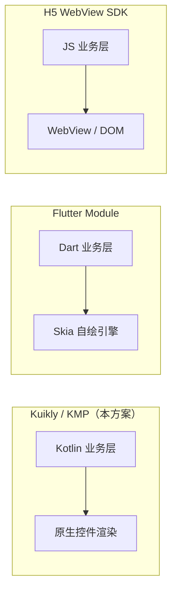

# 登录 SDK 性能对比：Kuikly/KMP vs Flutter vs H5

> 适用场景：可嵌入宿主 App 的**登录 SDK**（非整 App 跨端）  
> 对比对象：Kuikly/KMP（本方案）、Flutter Module、H5 WebView SDK

---

## 1. 登录 SDK 的性能关注点

登录 SDK 不像首页 Feed，性能瓶颈通常不在 60fps 滚动，而在：

| 指标 | 含义 |
|------|------|
| **SDK 体积** | 宿主 App 增加的包体大小 |
| **初始化耗时** | `LoginSDK.init()` 到可展示登录页 |
| **首屏展示** | 打开登录页 → 表单可交互 |
| **交互响应** | 输入、按钮点击、验证码发送 |
| **第三方跳转** | 拉起微信 / Apple / Google 的延迟 |
| **内存占用** | SDK 驻留内存 |
| **退出后残留** | 登录完成后资源是否释放干净 |

---

## 2. 三种方案架构差异



| 维度 | Kuikly / KMP | Flutter Login SDK | H5 Login SDK |
|------|--------------|-------------------|--------------|
| **渲染** | 原生 View / Compose | Skia 自绘 | WebView HTML |
| **运行时** | Kotlin Native / JVM AOT | Flutter Engine + Dart VM | JS 引擎 + WebView |
| **跨层通信** | Bridge methodId（主路径无 JSON 解析） | Platform Channel | JSBridge / postMessage |
| **嵌入产物** | `.aar` / `.framework` / `.so` | Flutter Module + Engine | JS Bundle + WebView 容器 |
| **鸿蒙原生** | ✅ 正式支持（Kuikly 路线） | ⚠️ 支持有限 | ⚠️ 依赖 WebView |

### 2.1 平台覆盖范围（选型维度）

> **注意**：本节对比的是**技术方案能力**；**本预演工程当前仅 Android 可完整运行**（见 §6）。

| 平台 | Kuikly / KMP（本方案） | Flutter | H5 WebView SDK |
|------|------------------------|---------|----------------|
| **Android App** | ✅ 当前 Demo 可跑 | ✅ 成熟 | ✅ 嵌入宿主 WebView |
| **iOS App** | ⚠️ KMP 已配置 target，Provider 为占位 | ✅ 成熟 | ✅ 嵌入宿主 WebView |
| **鸿蒙 App** | ✅ Kuikly 官方路线（待接入） | ⚠️ 有限 | ⚠️ 依赖 WebView |
| **Web 浏览器（独立站点）** | ❌ 本工程无 `js`/`wasm` target | ✅ Flutter Web 官方支持 | ✅ 原生场景 |

**Web 相关说明（易混淆）：**

| 场景 | 本 KMP 方案 | Flutter | H5 |
|------|-------------|---------|-----|
| 宿主 App 内嵌登录页（WebView） | 可做，但非本仓库能力 | 可做 Module | ✅ 最典型 |
| 独立 Web 站点 / SPA | ❌ 需另做 JS SDK 或等 Kuikly Web | ✅ `flutter build web` | ✅ 天然支持 |
| 与 `login-sdk` 代码复用 | commonMain 逻辑可抽协议对齐 | Dart 独立实现 | TS/JS 独立实现 |

**结论**：若核心诉求包含 **Web 浏览器端**，Flutter 或独立 H5 SDK 比当前 KMP 预演更易落地；KMP/Kuikly 优势在 **原生 App 嵌入（轻、快）+ 鸿蒙**。

---

## 3. 分项对比

### 3.1 SDK 体积

| 方案 | 典型增量 | 说明 |
|------|----------|------|
| **Kuikly / KMP** | Android ~300KB 起（Kuikly 官方 AOT 数据） | 仅登录模块可更小；无 Engine 开销 |
| **Flutter Module** | **+3~8MB** | 即使只做登录页，也需携带 Flutter Engine |
| **H5 SDK** | **+100KB~500KB** | 体积最小，但依赖系统 WebView |

**结论**：H5 体积最小；Kuikly/KMP 次之；Flutter 最大。  
登录 SDK 需嵌入多个宿主 App 时，Flutter 的包体惩罚最明显。

---

### 3.2 初始化与首屏

| 方案 | 冷启动 | 热启动 | 说明 |
|------|--------|--------|------|
| **Kuikly / KMP + Compose** | ⭐⭐⭐⭐ | ⭐⭐⭐⭐⭐ | 无 Engine 预热，Activity / Compose 直接展示 |
| **Flutter Module** | ⭐⭐⭐ | ⭐⭐⭐⭐ | 首次需初始化 Engine（约 100~300ms 级） |
| **H5 WebView** | ⭐⭐ | ⭐⭐⭐ | WebView 创建 + HTML 加载 + JS 解析 |

**登录页典型耗时（经验量级，非正式 Benchmark）：**

| 方案 | 首屏可交互 |
|------|------------|
| Kuikly / KMP + Compose | 50~150ms |
| Flutter Module | 150~400ms |
| H5 WebView | 200~800ms（波动大） |

**结论**：Kuikly/KMP ≈ 原生 Compose；Flutter 多一层 Engine；H5 最慢且不稳定。

---

### 3.3 交互响应（表单 / 按钮）

| 方案 | 输入延迟 | 动画流畅度 | 软键盘 |
|------|----------|------------|--------|
| **Kuikly / KMP** | 原生级 | 原生级 | 系统原生行为 |
| **Flutter** | 接近原生 | 高（自绘一致） | 偶有遮挡差异 |
| **H5** | 明显劣于原生 | 一般 | WebView 焦点 / 遮挡问题多 |

登录页以 TextField + Button 为主，H5 在低端机上常见：输入 lag、键盘遮挡、焦点丢失。

**结论**：Kuikly/KMP ≈ 原生 > Flutter > H5。

---

### 3.4 第三方登录（微信 / Apple / Google）

三种方案在「拉起原生授权」阶段差异不大，因为都需跳转平台 SDK 或系统授权页：

```
用户点击「微信登录」
  → SDK 调起原生微信 / 系统授权页
  → 回调返回 code / idToken
  → 送后端换取 session
```

| 环节 | 三方案差异 |
|------|------------|
| 拉起微信 / Apple / Google | **几乎相同**（均走原生） |
| 回调处理 | KMP / Flutter 用 Module / Channel；H5 用 URL Scheme / JSBridge |
| 回调可靠性 | **原生 / KMP / Flutter > H5**（H5 在 WebView 内易被拦截） |

**结论**：第三方登录的性能瓶颈在**平台 SDK + 网络**，不在 UI 框架；H5 的弱项是**回调链路稳定性**。

---

### 3.5 内存占用

| 方案 | 登录页驻留内存 | 登录完成后 |
|------|----------------|------------|
| **Kuikly / KMP** | ~5~15MB | Activity 销毁即释放 |
| **Flutter Module** | ~15~40MB（含 Engine） | Engine 可能常驻 |
| **H5 WebView** | ~10~30MB | WebView 进程可能残留 |

**结论**：Flutter Engine 即使用户已登录仍可能常驻；H5 WebView 有泄漏风险；KMP 最接近原生。

---

## 4. 综合评分（登录 SDK 场景）

| 维度 | Kuikly / KMP | Flutter | H5 |
|------|:------------:|:-------:|:--:|
| 包体 | ⭐⭐⭐⭐ | ⭐⭐ | ⭐⭐⭐⭐⭐ |
| 冷启动 | ⭐⭐⭐⭐ | ⭐⭐⭐ | ⭐⭐ |
| 交互体验 | ⭐⭐⭐⭐⭐ | ⭐⭐⭐⭐ | ⭐⭐ |
| 第三方登录可靠性 | ⭐⭐⭐⭐⭐ | ⭐⭐⭐⭐ | ⭐⭐⭐ |
| 内存 | ⭐⭐⭐⭐⭐ | ⭐⭐⭐ | ⭐⭐⭐ |
| 跨端 UI 一致性（App 内） | ⭐⭐⭐⭐ | ⭐⭐⭐⭐⭐ | ⭐⭐⭐⭐⭐ |
| **Web 浏览器端** | ⭐（本工程未实现） | ⭐⭐⭐⭐⭐ | ⭐⭐⭐⭐⭐ |
| 鸿蒙原生支持 | ⭐⭐⭐⭐⭐ | ⭐⭐ | ⭐⭐⭐ |
| 开发栈统一（Kotlin） | ⭐⭐⭐⭐⭐ | ⭐⭐ | ⭐⭐ |

---

## 5. 选型结论（演讲用）

> **登录 SDK 的核心诉求是「轻、快、稳」：**
> - **H5**：最轻，但启动慢、交互差、第三方回调不稳定
> - **Flutter**：UI 一致性好，但 Engine 太重，嵌入多个宿主 App 包体惩罚大
> - **Kuikly / KMP**：原生渲染，体积和启动接近原生；业务逻辑跨端共享；鸿蒙支持最好

**推荐**：

| 诉求 | 推荐路线 |
|------|----------|
| 原生 App 嵌入、小包体、鸿蒙、Kotlin 栈统一 | **Kuikly / KMP**（本工程方向） |
| App + **Web 浏览器** 一套 UI、尽快全端交付 | **Flutter** 或 **H5 + 后端协议对齐** |
| 仅 Web 站点登录 | **H5 / Flutter Web**，不直接复用本仓库 `login-sdk` |

---

## 6. 与本预演工程的关系

| 项 | 说明 |
|----|------|
| **当前可运行** | 仅 **Android**（`android-host` + Jetpack Compose UI） |
| **iOS** | KMP 已配置 `ios*` target，`iosMain` Provider 为 **Stub 占位**，无 iOS 宿主 Demo |
| **Web** | **未实现**（`build.gradle.kts` 无 `js` / `wasmJs` target） |
| **Kuikly** | 文档与 API 已预留（`LoginUiContract`），**代码中尚未接入** Kuikly Render |
| **性能特征（Android）** | KMP + Compose ≈ 原生 Android；迁移 Kuikly Page 后预期仍优于 Flutter / H5 嵌入 |
| **预演范围** | 架构验证；**尚未做正式 Benchmark**（B1~B5 见 §7） |
| **数据依据** | Kuikly 官方 AOT 体积数据 + 业界 Flutter / H5 嵌入 SDK 的已知特征；**非本仓库实测** |

---

## 7. 正式立项后建议补充的 Benchmark

为支撑生产决策，建议在 Phase 2 实测以下指标：

| 编号 | 测试项 | 方法 |
|------|--------|------|
| B1 | SDK 包体增量 | 对比接入前后 APK / IPA 体积 |
| B2 | 冷启动耗时 | 从 `LoginSDK.init()` 到登录页首帧可交互 |
| B3 | 第三方授权链路 | 点击微信登录 → 收到 callback 的 P95 耗时 |
| B4 | 内存峰值 | 登录页展示期间 Android Profiler 采样 |
| B5 | 登录完成后残留 | 退出登录后 SDK 内存是否回落 |

**对比基线**：同功能登录页分别用 KMP Compose、Flutter Module、H5 WebView 实现，在相同设备上跑 B1~B5。

---

## 8. 参考链接

- [Kuikly 官方文档](https://kuikly.tds.qq.com/)
- [Kuikly 开源公告（AOT 体积数据）](https://cloud.tencent.cn/developer/article/2517161)
- 本工程架构说明：[ARCHITECTURE.md](./ARCHITECTURE.md)
- 接入指南：[INTEGRATION.md](./INTEGRATION.md)
